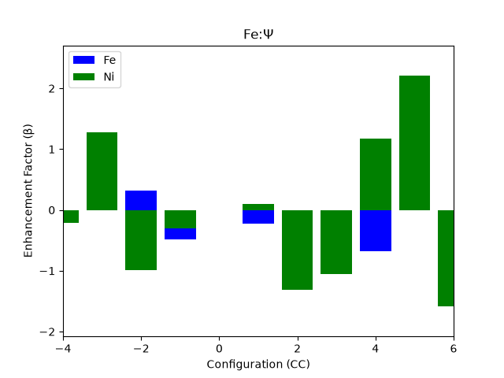

# gen-config

**Generalised Clapp-style configurational analysis for RMCProfile large-box atomic models.**

`gen-config` quantifies chemical short-range order in the large-box models produced by
[RMCProfile](https://rmcprofile.pages.ornl.gov/). For every distinct local atomic
configuration it computes the statistical **enhancement factor** (β) — how much more
(or less) common that configuration is than a random solid solution would predict.

It generalises the method of
[P. C. Clapp, *Atomic Configurations in Binary Alloys*, Phys. Rev. B **4**, 255 (1971)](https://doi.org/10.1103/PhysRevB.4.255)
— originally limited to binary primitive/FCC/BCC crystals — to **any crystal structure
with any number of constituent elements**. See [The method](method.md) for a short
overview.

!!! note "Input formats"
    `gen-config` currently reads RMCProfile `.rmc6f` configuration files and `.cif`
    structures only.

## Where next

- **[Installation](installation.md)** — `pip` / `pipx` / from source
- **[Usage](usage.md)** — the `dict` → `config` → `vis` workflow, interactive and scripted
- **[Output files](output-files.md)** — what every generated file contains
- **[Development](development.md)** — running the tests, contributing
